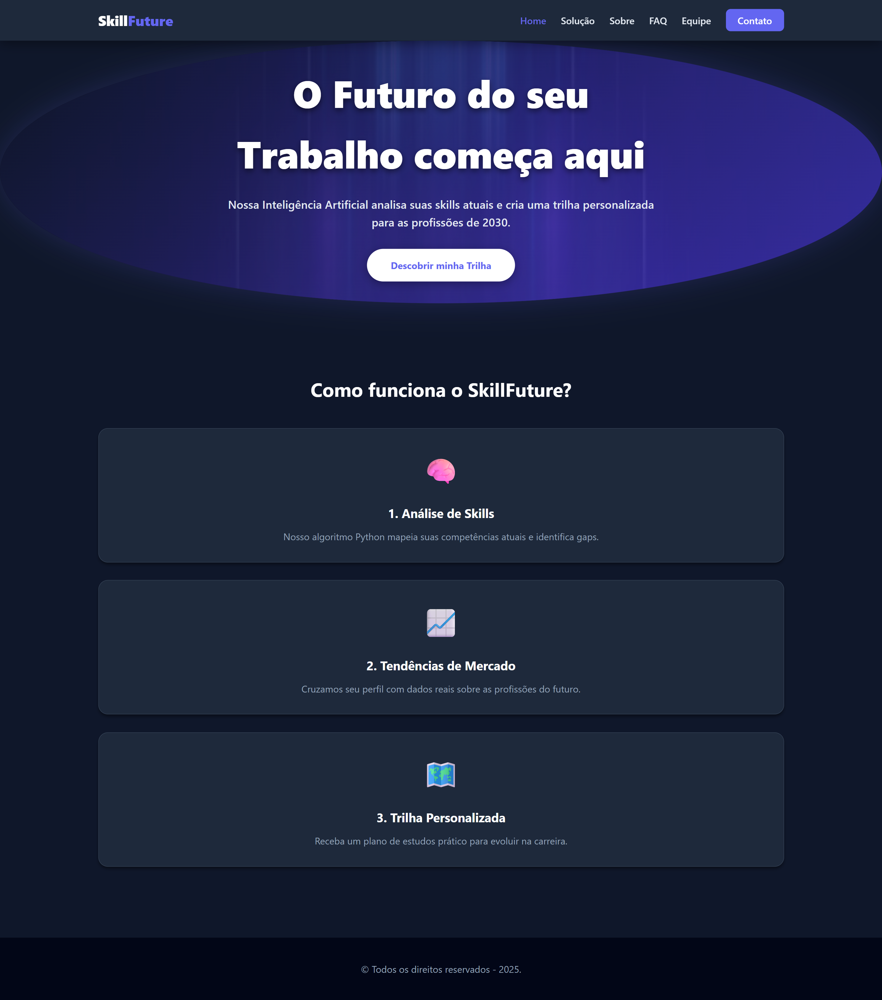
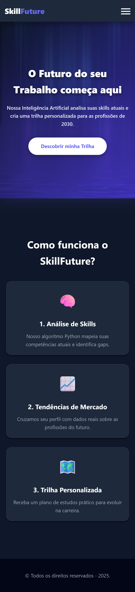

# 🚀 SkillFuture - O Futuro do Trabalho

> **Global Solution 2025 - FIAP**
>
> *Tema: O Futuro do Trabalho*

---

## 📝 Descrição do Projeto

O mercado de trabalho passa por uma transformação sem precedentes. Segundo o Fórum Econômico Mundial, a automação e a IA devem transformar radicalmente 23% das profissões até 2027. O **SkillFuture** nasce como uma resposta a esse desafio.

Nossa solução é uma plataforma de **Upskilling e Reskilling** guiada por Inteligência Artificial. Conectamos as habilidades atuais do usuário com as demandas futuras do mercado, gerando trilhas de aprendizado personalizadas.

---

## 🌐 Acesse o Projeto (Live Demo)

A versão final do site está publicada e pode ser acessada através do link abaixo:

### 👉 [CLIQUE AQUI PARA ACESSAR O SITE AO VIVO](https://gcorrea4.github.io/GlobalSolution/)

*(Dica: Segure CTRL + Clique para abrir em nova guia)*

---

## ✨ Funcionalidades e Páginas Implementadas

* **Design Totalmente Responsivo:** O layout de todas as 7 páginas se adapta perfeitamente aos 5 breakpoints exigidos (celulares, tablets, laptops e desktops), utilizando **CSS Grid**, **Flexbox** e **Media Queries**.
* **Validação de Formulários:** A página de "Contato" possui validação de campos (nome, email, mensagem) feita com JavaScript puro, exibindo mensagens de erro dinâmicas.
* **Manipulação do DOM:** O JavaScript é usado para exibir e esconder dinamicamente as mensagens de erro e sucesso do formulário.
* **Estrutura Completa de 7 Páginas:** O projeto contém todas as páginas obrigatórias (Home, Equipe, Contato, FAQ, Sobre) e extras (Solução, Trilhas) com navegação consistente.
* **FAQ Interativo:** Uso das tags `
` e `
` com script para criar um efeito "sanfona" (abre um, fecha o outro).
* **Integração com IA:** Página dedicada a explicar a arquitetura do Chatbot (Node-RED + Watson + Gemini) com link direto para o Telegram.

---

## 🛠️ Estrutura e Tecnologias

* **HTML5 Semântico:** Uso correto de tags como `<header>`, `<main>`, `<section>`, `<nav>`, `<article>`, etc.
* **CSS3 Moderno:** Estilização avançada com Flexbox, Grid e Media Queries para garantir a responsividade. Tema Dark Mode com variáveis CSS (`:root`).
* **JavaScript (ES6+):** Utilizado para validação de formulários, menu responsivo e manipulação do DOM.
* **Estrutura de Pastas Organizada:**
    * `/assets/page` para HTML
    * `/assets/css` para estilos
    * `/assets/js` para scripts
    * `/assets/img` para imagens
* **Git & GitHub:** Versionamento de código com histórico de commits da equipe.

---

## 📸 Screenshots do Projeto

### 🖥️ Versão Desktop

### 📱 Versão Mobile

---

## 👨‍💻 Equipe

| Integrante | RM | Links |
| :--- | :--- | :--- |
| **Gabriel Correa** | 567903 | [GitHub](https://github.com/gcorrea4) \| [LinkedIn](https://www.linkedin.com/in/gabriel-correa-souza-763135271/) |
| **Kayque Duarte** | 567980 | [GitHub](https://github.com/Kayque2012) \| [LinkedIn](https://www.linkedin.com/in/kayque-duarte-b24313361) |
| **Eric Maciel** | 567398 | [GitHub](https://github.com/Eric-devops-tech) \| [LinkedIn](https://www.linkedin.com/in/eric-maciel-144058389) |

---

© 2025 Todos os direitos reservados - 2025.