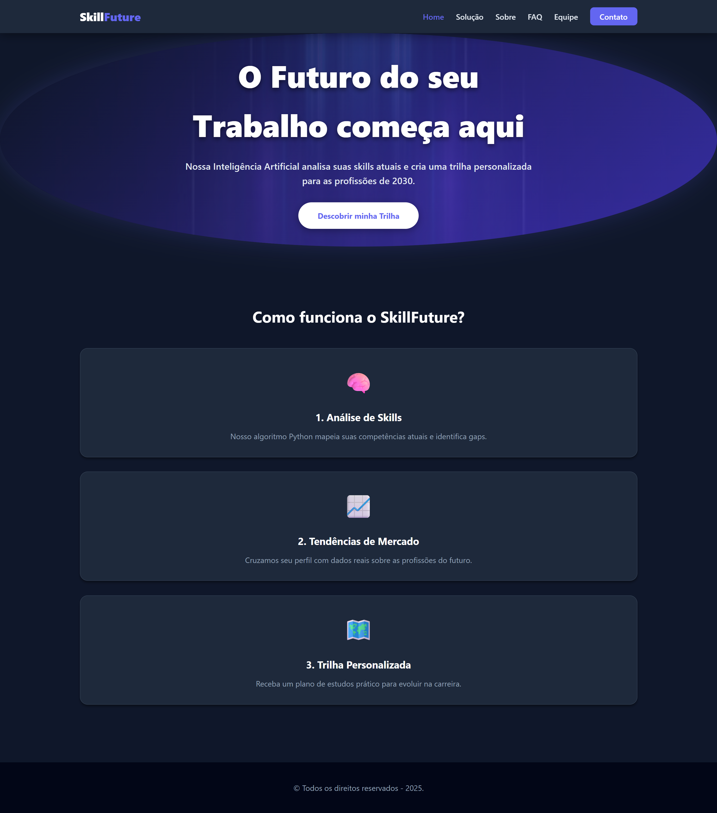

# 🚀 SkillFuture - O Futuro do Trabalho

> **Projeto desenvolvido para a Global Solution 2025 - FIAP**
>
> *Tema: O Futuro do Trabalho*

---

## 📝 Descrição do Projeto

O mercado de trabalho passa por uma transformação sem precedentes. Segundo o Fórum Econômico Mundial, a automação e a IA devem transformar radicalmente 23% das profissões até 2027. O **SkillFuture** nasce como uma resposta a esse desafio.

Nossa solução é uma plataforma de **Upskilling e Reskilling** guiada por Inteligência Artificial. Conectamos as habilidades atuais do usuário com as demandas futuras do mercado, gerando trilhas de aprendizado personalizadas.

---

## 🌐 Acesse o Projeto (Live Demo)

A versão final do site está publicada e pode ser acessada através do link abaixo:

### 👉 [CLIQUE AQUI PARA ACESSAR O SITE AO VIVO](https://gcorrea4.github.io/GlobalSolution/)

---

## ✨ Funcionalidades e Diferenciais Técnicos

* **Design Totalmente Responsivo:** Layout adaptado para 5 breakpoints (celulares, tablets, laptops e desktops), utilizando **CSS Grid**, **Flexbox** e **Media Queries**.
* **Validação de Formulários:** Sistema de feedback dinâmico em JavaScript puro para a página de contato.
* **Manipulação Avançada do DOM:** Controle de estados, modais e navegação dinâmica sem o uso de bibliotecas externas.
* **Painel Interativo de Problemas:** Sistema de navegação por abas laterais customizado.
* **FAQ Inteligente:** Lógica de acordeão com auto-fechamento.
* **Arquitetura de IA (SkillUp):** O site apresenta a solução de IA orquestrada via **Node-RED**, integrando **Google Gemini** e **IBM Watson**. Confira o repositório da IA [aqui](https://github.com/gcorrea4/skillup-ai-orchestrator).

---

## 🛠️ Tecnologias e Organização

* **HTML5 Semântico:** Estrutura focada em acessibilidade e SEO.
* **CSS3 Moderno:** Uso de variáveis CSS (`:root`) para gerenciamento de cores e tema Dark Mode.
* **JavaScript Modular:** Scripts separados por responsabilidade (`menu.js`, `contato.js`, `faq.js`, `problemas.js`).

---

## 📸 Screenshots

  
   
  

---

## 👨‍💻 Desenvolvedor

| Nome | RM | Links |
| :--- | :--- | :--- |
| **Gabriel Correa** | 567903 | [GitHub](https://github.com/gcorrea4) \| [LinkedIn](https://www.linkedin.com/in/gabriel-correa-souza-763135271/) |

> **Nota:** Este projeto foi realizado no contexto acadêmico da FIAP, sendo todo o desenvolvimento de Front-end e a arquitetura da solução SkillUp realizados integralmente por mim.

---

© 2025 Gabriel Correa Souza.